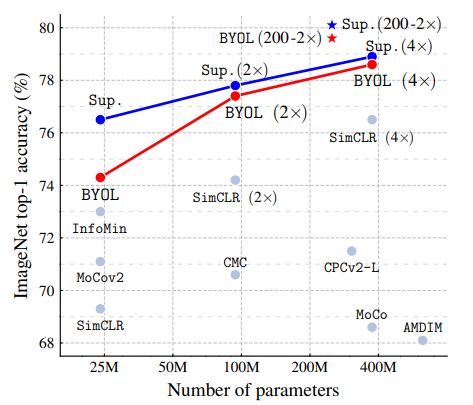
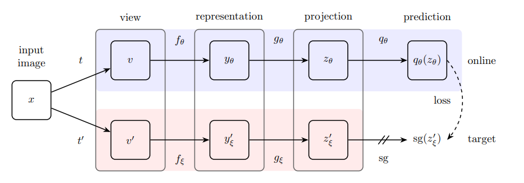

# **Self-Supervised-Learning-with-BYOL-and-Lightly**
Studying self-supervised learning (SSL) for computer vision and the BYOL (Bootstrap Your Own Latent) approach to SSL.

## **Introduction**

**Self-Supervised Learning with BYOL (Bootstrap Your Own Latent)**

**Self-supervised learning** is a form of unsupervised learning where the system learns to predict part of its input from other parts of its input. The key idea is to create a supervised learning task from unlabeled data, allowing the model to learn representations that can be useful for a wide range of tasks without the need for manually annotated labels. This approach leverages the inherent structure in the data to generate labels from the data itself, often through cleverly designed **pretext tasks**. It has become increasingly popular due to its ability to leverage large amounts of unlabeled data, significantly reducing the dependence on expensive labeled datasets.    
    
### **General Process**
**Pretext Task Creation**: A pretext task is created from the unlabeled data. The nature of this task can vary widely but is designed so that solving it will require the model to understand and learn meaningful representations of the data.   

**Model Training**: The model is trained on this self-generated supervised task, learning to predict the artificially created labels from the input data.

**Feature Extractio**: After training, the learned representations (features) can be used for **downstream tasks**. These tasks are often the actual target tasks we care about, such as classification, detection, or segmentation in vision, and various NLP tasks in text.

### **Popular Approaches**

**Contrastive Learning**: This approach involves learning representations by contrasting positive pairs against negative pairs. A positive pair consists of two different augmentations of the same data point, while negative pairs are generated from different data points. The model learns by bringing the representations of positive pairs closer and pushing those of negative pairs apart. Examples include SimCLR and MoCo.

**Cluster-Based Learning**: Techniques like DeepCluster and SeLa work by clustering the feature space to assign pseudo-labels to the data, then training the model to predict these cluster assignments. This cyclic process of clustering and prediction helps in learning useful features.

**Prediction-Based Methods**: These methods involve predicting some part of the data from another. Examples include predicting the future frames in a video or the missing part of an image. In natural language processing (NLP), a popular method is predicting the next word in a sentence, as seen in models like BERT, which predicts masked words in a sentence.

**BYOL (Bootstrap Your Own Latent)**: A novel approach that avoids the need for negative pairs by training two networks simultaneously: an online network and a target network. The online network learns to predict the target network's representation of the same data point under a different augmentation.

**SimSiam**: Similar to BYOL, SimSiam operates without negative pairs but simplifies the architecture by not using a moving average target network. Instead, it employs a stop-gradient operation to prevent collapsing.

### **Advantages and Challenges**
#### **Advantages**:

* Reduces the reliance on expensive labeled data.

* Can leverage vast amounts of unlabeled data available.

* Learned representations are often more generalizable across different tasks.

#### **Challenges**:

* Designing effective pretext tasks is non-trivial and often domain-specific.

* Some approaches, particularly contrastive learning, require careful negative pair sampling to avoid trivial solutions.

It is on ongoing research question as to the best practices for transferring self-supervised learning features to downstream tasks.

Self-supervised learning has the continuing potential to unlock more scalable and efficient ways to learn from data. Self-supervised learning development continues to be an area of active research, with new methods and improvements being proposed regularly.

In this notebook we implement the BYOL approach to self-supervised learning learning the Lightly Python library (https://pypi.org/project/lightly/). 

## **BYOL: Bootstrap Your Own Latent**

**BYOL (Bootstrap Your Own Latent)** is a novel approach to **self-supervised learning** introduced in a paper by Jean-Bastien Grill, Florian Strub, Florent Altché, Corentin Tallec, Pierre H. Richemond, Elena Buchatskaya, Carl Doersch, Bernardo Avila Pires, Zhaohan Daniel Guo, Mohammad Gheshlaghi Azar, Bilal Piot, Koray Kavukcuoglu, Rémi Munos, and Michal Valko. The main idea behind BYOL is to train a deep neural network to learn powerful representations without relying on negative samples, which is a common requirement in many other self-supervised learning frameworks.

Mechanics of BYOL:

**Architecture**: BYOL utilizes a dual-network architecture consisting of a target network and an online network. Both networks have the same architecture but do not share weights. The online network is updated through backpropagation during training, while the target network's weights are updated as a slow-moving average of the online network's weights. This means the target network evolves more smoothly over time.

**Learning Process**: The core idea is to make the representation of an augmented version of an image (produced by the online network) similar to the representation of another augmented version of the same image (produced by the target network). BYOL uses two sets of data augmentations to create these two different views of the same image. These augmentations can include cropping, resizing, color jittering, etc.

**Loss Function**: The similarity between the representations is measured using a loss function (e.g., mean squared error). The goal is to minimize the distance between the representations of the two augmented views of the same image as produced by the online and target networks, respectively.

**No Negative Pairs**: Unlike contrastive learning approaches that require comparing positive pairs (similar or the same data points) with negative pairs (dissimilar data points) to learn useful features, BYOL does not use negative pairs. It only relies on positive pairs and still learns useful representations. This is significant because managing negative pairs can be challenging and computationally expensive in large datasets.

**Update Mechanism**: The target network's parameters are updated as an exponential moving average of the online network's parameters. This update mechanism is key to BYOL's performance, as it provides stability to the learning process and helps in learning consistent representations.

Grill, Jean-Bastien, Florian Strub, Florent Altché, Corentin Tallec, Pierre Richemond, Elena Buchatskaya, Carl Doersch et al. "Bootstrap your own latent-a new approach to self-supervised learning." Advances in neural information processing systems 33 (2020): 21271-21284.

## **Conclusion**

BYOL has shown impressive results in learning visual representations without labels, outperforming or matching the state-of-the-art methods on various benchmarks. Its effectiveness without negative pairs challenges the previously held belief that contrastive learning with negative samples was necessary for successful self-supervised learning.

### **References**

[1] Grill, J.B., Strub, F., Altché, F., Tallec, C., Richemond, P., Buchatskaya, E., Doersch, C., Avila Pires, B., Guo, Z., Gheshlaghi Azar, M. and Piot, B., 2020. Bootstrap Your Own Latent-A New Approach to Self-Supervised Learning. Advances in neural information processing systems, 33, pp.21271-21284.

Abstract from BYOL paper: We introduce Bootstrap Your Own Latent (BYOL), a new approach to selfsupervised image representation learning. BYOL relies on two neural networks, referred to as online and target networks, that interact and learn from each other. From an augmented view of an image, we train the online network to predict the target network representation of the same image under a different augmented view. At the same time, we update the target network with a slow-moving average of the online network. While state-of-the art methods rely on negative pairs, BYOL achieves a new state of the art without them. BYOL reaches 74.3% top-1 classification accuracy on ImageNet using a linear evaluation with a ResNet-50 architecture and 79.6% with a larger ResNet. We show that BYOL performs on par or better than the current state of the art on both transfer and semi-supervised benchmarks. Our implementation and pretrained models are given on GitHub.

[2] Review — BYOL: Bootstrap Your Own Latent A New Approach to Self-Supervised Learning Outperforms Contrastive Learning Approaches: SimCLR, MoCo v2, CPCv2, CMC, MoCo. https://sh-tsang.medium.com/review-byol-bootstrap-your-own-latent-a-new-approach-to-self-supervised-learning-6f770a624441.

[3] BYOL —The Alternative to Contrastive Self-Supervised Learning, Paper Analysis—Bootstrap Your Own Latent: A New Approach to Self-Supervised Learning. https://towardsdatascience.com/byol-the-alternative-to-contrastive-self-supervised-learning-5d0a26983d7c.
